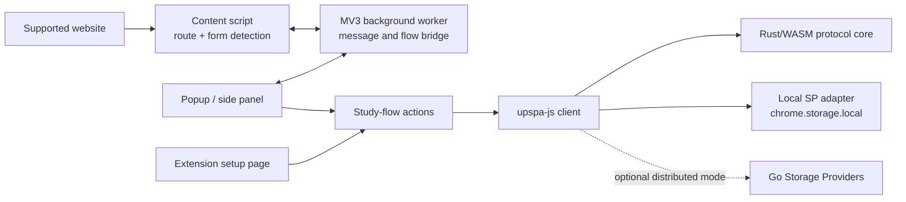

# UpSPA Relaxed User-Study Extension

This repository contains the **agile usability-study build** of the UpSPA browser extension. It is intentionally based on the relaxed prototype snapshot—not on the main UpSPA extension branch.

The study build keeps the real Rust/WASM protocol and extension flow, but defaults to one in-browser Storage Provider so a participant can complete a session without Go services, PostgreSQL, Docker, or cloud infrastructure.

> [!WARNING]
> This is a research prototype for controlled usability testing. It is not a production password manager and must not be used with valuable, personal, financial, or otherwise sensitive accounts.

## At a glance

| Item | Study build |
|---|---|
| Intended use | Controlled Chrome/Chromium usability sessions |
| Default storage | One local prototype SP in `chrome.storage.local` |
| Threshold | `1-of-1` |
| Website scope | 40 curated study-site definitions |
| Page selection | Hardcoded routes first; form detection as fallback |
| Form submission | Never automatic; the participant submits |
| Registration/update commit | Only after explicit participant confirmation |
| Active-flow lifetime | 30 minutes |
| Minimum master-password length | 6 characters (study relaxation) |
| Distributed mode | Retained for regression/developer compatibility only |
| Production-ready | No |

## What “relaxed” means

The user-study version deliberately changes deployment and UX constraints while leaving the core protocol implementation available:

- `storageMode` defaults to `local-prototype`.
- A single `LocalStorageProviderClient` replaces the normal networked SP set.
- Local mode uses threshold `1` with `local://sp-1`.
- Local SP state, key-share material, and opaque records live inside the extension profile.
- Password-update signature verification is skipped by the local SP adapter only. The Go distributed SP still verifies signatures.
- The master-password UI accepts six or more characters to reduce friction during a moderated study.
- A conservative 16–20 character, mixed-case alphanumeric website policy is used for most sites; site-specific overrides are kept in the registry.
- Content-script access is limited to hostnames in the curated registry.
- The participant must confirm successful account creation or password change before UpSPA commits the prepared record.
- The extension fills fields but does not submit real website forms.

These are usability-study decisions, not security claims.

## Features included

- Extension-owned first-run setup and local SP provisioning.
- Site-aware dashboard for a curated 40-site registry.
- Saved-account picker with multiple accounts per website.
- Sign-in flow with multi-step page continuation.
- New-account registration with deterministic policy-compatible passwords.
- Existing-account enrollment through the website’s password-change flow.
- Per-website password update (the UpSPA protocol’s secret-update operation).
- Separate master-password update that preserves website accounts.
- Popup, side-panel, and embedded-panel fallbacks.
- Event-driven page/form detection for dynamic sites.
- Encrypted pending registration, secret-update, and continuation material.
- Unit/integration tests for study flows, page classification, local storage, and protocol helpers.
- Optional distributed SP and demo-login-server reference stack.

## Architecture



The local study path is:

```text
popup/options -> upspaActions -> upspa-js -> Rust/WASM
                                  |
                                  +-> LocalStorageProviderClient -> Chrome local storage
```

See [Architecture and flow mapping](docs/ARCHITECTURE.md) for the exact controller-to-protocol function mapping and persistence model.

## Repository layout

```text
.
├── packages/
│   ├── extension/             Chrome Manifest V3 study extension
│   │   ├── public/            Static extension assets
│   │   ├── src/               Popup, options, background, content, shared state
│   │   └── test/              Cross-module study-flow tests
│   └── upspa-js/              TypeScript protocol/SP client
├── crates/
│   ├── upspa-core/            Rust protocol implementation and vectors
│   ├── upspa-wasm/            Browser WASM bindings
│   └── upspa-cli/             Optional protocol-development CLI
├── services/storage-provider-go/
│                              Optional distributed reference SP
├── demo/light-login-server/   Optional engineering fixture
├── docker/                    Optional distributed demo images/init SQL
├── docs/                      Study, architecture, protocol, API, security docs
├── scripts/                   Portable build helpers
├── compose.yaml               Optional 3-SP distributed demo
└── pnpm-workspace.yaml        Workspace definition
```

Generated dependencies and build output are intentionally excluded from Git. A clean checkout is small and reproducible.

## Prerequisites

Required for the study extension:

- Node.js 20 or newer.
- pnpm 11.9.0 (the version declared in `package.json`).
- Rust stable and Cargo.
- `wasm-pack` 0.15.x.
- Chrome or a Chromium browser with Manifest V3 and side-panel support.

Optional:

- Go 1.25+ for the distributed SP tests.
- Docker for the distributed reference stack and database-backed Go tests.

Example tool checks:

```bash
node --version
pnpm --version
rustc --version
cargo --version
wasm-pack --version
```

Install `wasm-pack` with Cargo if needed:

```bash
cargo install wasm-pack --locked --version 0.15.0
```

If `wasm-pack` is installed somewhere outside `PATH`, set `WASM_PACK_BIN` to its executable before building.

## Quick start

### 1. Install dependencies

From the repository root:

```bash
pnpm install --frozen-lockfile
```

### 2. Build the complete extension

```bash
pnpm build
```

This performs, in order:

1. Rust/WASM generation into `packages/upspa-js/wasm-pkg`.
2. TypeScript client compilation into `packages/upspa-js/dist`.
3. Extension bundling into `packages/extension/dist`.

All three output directories are generated and ignored by Git.

### 3. Load the unpacked extension

1. Open `chrome://extensions`.
2. Enable **Developer mode**.
3. Select **Load unpacked**.
4. Choose `packages/extension/dist`.
5. Pin **UpSPA Relaxed Study** to the toolbar if useful.

After rebuilding, click the extension’s reload button on `chrome://extensions` and refresh the study website.

### 4. Complete study setup

1. Open the extension.
2. Select **Continue setup**.
3. Enter a synthetic study email/account ID.
4. Create and confirm a study master password of at least six characters.
5. Complete the personal-information checklist.
6. Confirm **Create account**.

The extension provisions one local SP automatically. No server process is required.

## Safe study profile

Use a dedicated, disposable Chrome profile for every participant or session:

1. Turn off browser sync.
2. Do not install another password-manager extension in that profile.
3. Use only synthetic or disposable study accounts.
4. Do not use real payment, work, university, health, or primary email accounts.
5. Verify the selected website routes and field behavior before the participant session.
6. Remove the study profile after collecting only the data covered by consent.

The repository contains no telemetry or analytics pipeline. Any observation, screen recording, questionnaire, or event collection must be handled separately and with the study’s consent/data-management process.

## Participant flows

### Sign in with a saved account

1. Open a supported login route.
2. Open the UpSPA popup/side panel.
3. Select a saved account.
4. Enter the study master password.
5. Select **Sign in**.
6. Inspect the filled fields and submit the website form manually.

For multi-step sites, UpSPA stores an encrypted, tab-bound continuation for up to 30 minutes so it can fill the password step after navigation.

### Create a new website account

1. Open a supported sign-up route or choose **Add another account** → **Create a new account**.
2. Enter the website account ID and study master password.
3. Review the registry-derived password settings.
4. Generate and fill the sign-up form.
5. Submit on the website manually.
6. Only after the website accepts the account, return to UpSPA and choose **Account created**.

Cancelling or allowing the pending flow to expire does not commit the prepared registration.

### Add an existing account

1. Choose **Add another account** → **Add an existing account**.
2. Continue to the site’s password-change route.
3. Enter the account ID, master password, and current website password.
4. UpSPA encrypts the continuation temporarily, prepares a derived replacement, and fills the password-change fields.
5. Submit manually.
6. Confirm **Existing account updated** only after the site succeeds.

### Update a website password

1. Open the registered password-change route or choose **Update Website Password**.
2. Select the exact saved account.
3. Enter the master password and review the generated candidate.
4. Let UpSPA fill current/new/confirmation fields.
5. Submit manually.
6. Choose **Password changed** only after website acceptance; choose **Website rejected it** to retry without committing.

This maps to UpSPA’s **secret update**, not its master-password update.

### Update the master password

1. Choose **Update Master Password** from the dashboard.
2. Verify the current master password.
3. Enter and confirm a new master password.
4. Complete the checklist and confirm the update.

Saved website-account records remain available. Use the new master password for the next sensitive action.

The complete facilitator and reset checklist is in [User-study guide](docs/USER_STUDY.md).

## Supported websites

The current registry contains 40 definitions. It includes login, sign-up, password-change routes, difficulty labels, field hints, and policy notes.

The source of truth is [`supportedSites.ts`](packages/extension/src/shared/supportedSites.ts). A human-readable inventory is in [Supported study sites](docs/SUPPORTED_SITES.md).

Website UIs, routes, CAPTCHA behavior, authentication methods, and password rules change without notice. Treat every registry entry as a study adapter that must be checked shortly before a session, not as a compatibility guarantee.

## Development commands

| Command | Purpose |
|---|---|
| `pnpm build` | Build WASM, TypeScript client, and unpacked extension |
| `pnpm build:wasm` | Regenerate `wasm-pack` output |
| `pnpm build:client` | Compile `upspa-js` |
| `pnpm build:extension` | Bundle the Chrome extension |
| `pnpm dev:extension` | Build prerequisites, then start Vite development mode |
| `pnpm typecheck` | Type-check extension production sources |
| `pnpm test:unit` | Run client and extension test suites |
| `pnpm test:rust` | Run Rust protocol tests |
| `pnpm test:go` | Run optional distributed SP tests |
| `pnpm verify` | Full study-extension build, type-check, JS tests, and Rust tests |
| `pnpm demo:site` | Start the optional local login-server engineering fixture |
| `pnpm format:check` | Verify Rust formatting |
| `pnpm lint:rust` | Run Clippy for workspace libraries/binaries |

`pnpm demo:site` is not part of the curated 40-site participant workflow. It remains as an engineering fixture for distributed/protocol work.

## Test coverage and validation

The repository includes:

- Extension tests for the 40-site registry, route classification, Manifest V3 scope, setup state, local SP behavior, event dispatch, multi-step continuation, protected pending state, and the relaxed flow orchestration.
- `upspa-js` unit tests for encoding and client behavior.
- Rust integration/vector tests for the protocol core.
- Go unit, contract, and optional Docker-backed integration tests for the distributed SP.

The local-prototype orchestration test mocks `upspa-js`/WASM. A successful automated build does not replace the manual Chrome smoke test in `docs/USER_STUDY.md`.

## Optional distributed reference stack

The study does not require this stack. It is retained to ensure the relaxed UI layer does not erase the distributed implementation.

Start three SPs, PostgreSQL, and three demo login servers:

```bash
docker compose up --build
```

Endpoints:

- SPs: `http://localhost:8081`, `8082`, `8083`
- Demo login servers: `http://localhost:3000`, `3001`, `3002`

Stop the stack:

```bash
docker compose down
```

Delete its demo databases:

```bash
docker compose down --volumes
```

The participant UI intentionally exposes only local-prototype setup. Distributed end-to-end experiments require developer configuration/code and are outside the normal study procedure.

## Data and privacy model

The prototype stores data only in the extension profile unless a developer explicitly selects the distributed path.

| Data | Location | Notes |
|---|---|---|
| Study configuration and setup flag | `chrome.storage.local` | Includes UID, mode, threshold, and SP descriptors |
| Local SP setup/records | `chrome.storage.local` | Includes opaque ciphertext records and the one local key share |
| Saved site-account metadata | `chrome.storage.local` | Origin/account ID, policy, counters, and protocol identifiers |
| Pending registration/update material | `chrome.storage.local` | Encrypted with a key derived from the study master password |
| Multi-step credential continuation | Encrypted blob in `chrome.storage.local` | Random vault key normally lives in `chrome.storage.session`; local fallback exists |
| Active flow metadata | `chrome.storage.session` when available | No plaintext master password is stored in flow metadata |

The extension does not persist the plaintext master password. Sensitive multi-step website material can exist encrypted for up to 30 minutes and should be cleared by flow completion, cancellation, expiry, or profile disposal.

## Known limitations

- The `1-of-1` local SP and six-character minimum are unsuitable for security evaluation.
- Local password-update handling deliberately skips signature verification.
- All local SP state lives in one browser profile; this is not distributed trust.
- Some sites use different origins for sign-up, login, and settings. Site-account records are currently origin-bound, so cross-origin flows may require re-enrollment or a registry/code fix.
- Many registry sites prefer SSO, magic links, passkeys, phone verification, or CAPTCHA; a password flow may be unavailable.
- Field hints and routes can become stale as websites change.
- The build targets Chrome/Chromium Manifest V3. Firefox is not supported by this study repository.
- There is no signed extension package or automated browser end-to-end suite.
- The local demo login server is an engineering fixture, not a real integration contract for third-party websites.
- Removing or clearing the extension profile destroys the local prototype state.

## Troubleshooting

### Windows reports that `link.exe` is missing

Native Rust and WASM builds on Windows require the Microsoft C++ linker. Install
Visual Studio Build Tools with the **Desktop development with C++** workload, or
run the Rust/WASM build step in WSL and return to Windows for the extension build.

### `wasm-pack` cannot be found

Install it or point the build script at the executable:

```powershell
$env:WASM_PACK_BIN = 'C:\path\to\wasm-pack.exe'
pnpm build:wasm
```

```bash
WASM_PACK_BIN=/path/to/wasm-pack pnpm build:wasm
```

### Missing `wasm-pkg` or `upspa-js/dist`

Run the root build rather than building the extension workspace directly:

```bash
pnpm build
```

### A supported site shows the wrong flow

Check its route entry in `supportedSites.ts`, then inspect the current URL and detected form type. Hardcoded route classification wins; generic form detection is only a fallback on neutral/shared routes.

### Fields are not filled

Reload the unpacked extension, refresh the page, confirm the domain is in the registry, and check whether the website moved the credential form into a new hostname or a restricted frame.

### A pending flow cannot be resumed

Pending/continuation records expire after 30 minutes and are bound to the intended site, tab, and/or origin. Restart the flow if it expired or the website crossed to an unregistered origin.

## Documentation

- [User-study guide](docs/USER_STUDY.md)
- [Architecture and flow mapping](docs/ARCHITECTURE.md)
- [Supported study sites](docs/SUPPORTED_SITES.md)
- [Protocol phases](docs/protocol-phases.md)
- [Security notes](docs/security.md)
- [Storage Provider API](docs/apis.md)
- [OpenAPI specification](docs/openapi/sp.yaml)

## License

Apache License 2.0. See [LICENSE](LICENSE).
